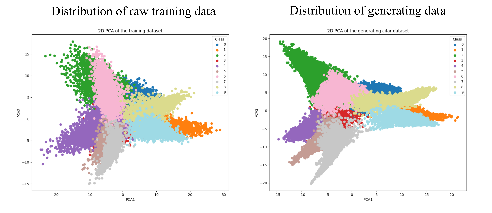

# model_stealing
## About
This is the source code that uses large models to steal the data distribution of (small) victim models.

There are five tasks: MNIST, CIFAR10, SKIN_CANCER, IMDB, Private PET. 
Private PET: [https://drive.google.com/drive/folders/1-YeaQ7kiQvkmK2EHkjT_upb_j5zZAS-y](https://drive.google.com/drive/folders/1-YeaQ7kiQvkmK2EHkjT_upb_j5zZAS-y?usp=sharing)
## Attack Intuition
We compared the distribution scatter plot of the raw training data with that of the generated data. Taking CIFAR10 task as an example, the figure is as follow. It is our attack intuition since the distributions of both are similar.

    

